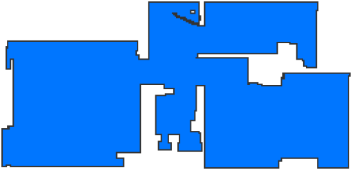
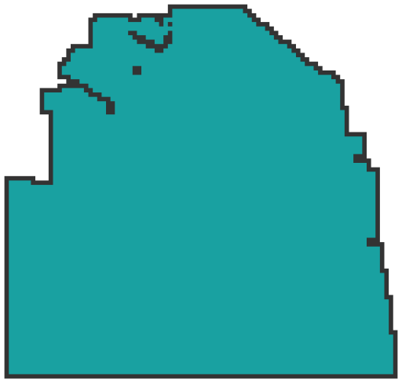
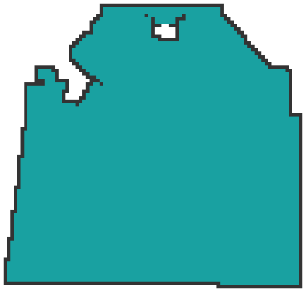

# Valetudo stickers

## Colors

- Floor: #0076FF
- Walls: #333333
- Segments: #19A1A1, #7AC037, #DF5618, #F7C841, #9966CC

Source: https://github.com/Hypfer/Valetudo/blob/master/frontend/src/map/MapLayerRenderer.ts#L84

## Build Telegram stickers

### Requirements

- [ImageMagick](https://imagemagick.org/)
- [Exiftool](https://exiftool.org/)
- [Optipng](http://optipng.sourceforge.net/)

```
./make_stickers.sh
```

### Generate SVGs

https://codepen.io/shshaw/pen/XbxvNj

## Stickers









